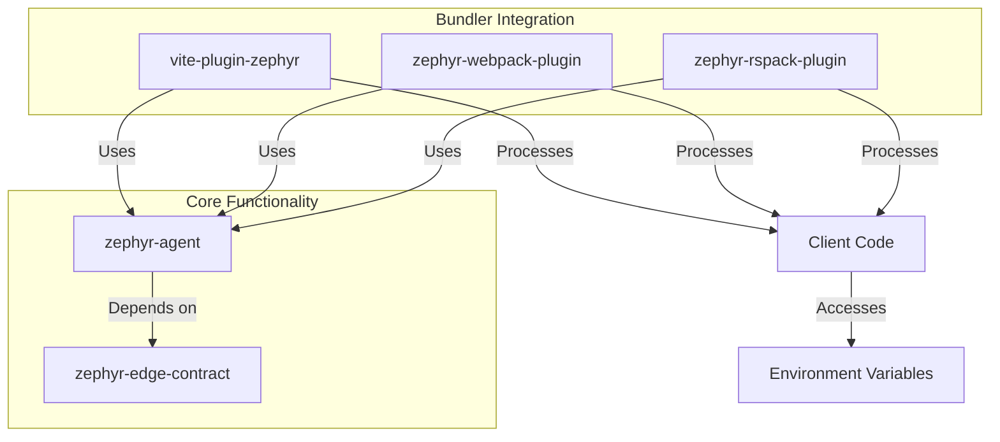
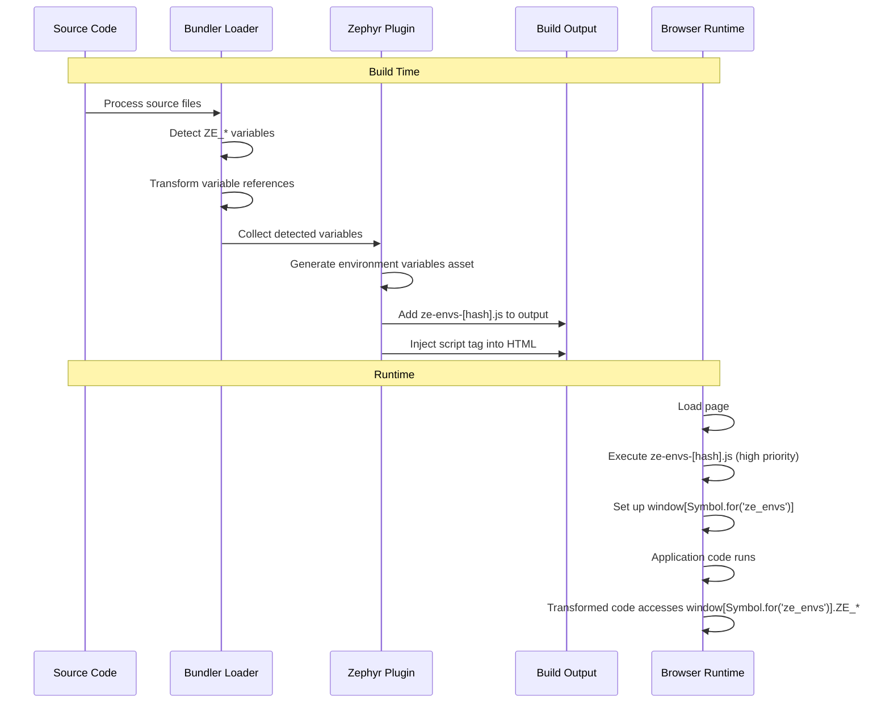

# Zephyr Environment Variables Handling

This document explains how Zephyr handles environment variables across different bundlers (Webpack, Rspack, and Vite). The system provides a consistent way to access environment variables with the `ZE_` prefix in client-side code.

## Overview

The Zephyr environment variables system:

1. Detects variables with the `ZE_` prefix in source code during build time
2. Transforms access patterns to use a global runtime symbol
3. Generates an asset containing the variable values
4. Injects the asset into HTML with high priority loading

## Supported Variable Access Patterns

```javascript
// Using import.meta.env (recommended for Vite, Rspack, modern bundlers)
const environment = import.meta.env.ZE_ENVIRONMENT;
const appVersion = import.meta.env['ZE_APP_VERSION'];

// Using process.env (for compatibility with older projects)
const environment = process.env.ZE_ENVIRONMENT;
const appVersion = process.env['ZE_APP_VERSION'];
```

## Plugin Architecture



## Build Process Timeline



## Implementation Details

### 1. Variable Detection and Transformation

During the build, the plugin scans source code for references to environment variables with the `ZE_` prefix. It transforms these references to use a global symbol:

| Original Code                 | Transformed Code                             |
| ----------------------------- | -------------------------------------------- |
| `import.meta.env.ZE_VARIABLE` | `window[Symbol.for('ze_envs')]?.ZE_VARIABLE` |
| `process.env.ZE_VARIABLE`     | `window[Symbol.for('ze_envs')]?.ZE_VARIABLE` |

This transformation ensures that:

- Variables are accessed from a known global location at runtime
- The access pattern is consistent regardless of how the variable was originally referenced
- Tree-shaking and minification don't remove the variable references

### 2. Asset Generation

The plugin generates a JavaScript asset containing the detected environment variables and their values:

```javascript
// Simplified version of ze-envs-[hash].js
(() => {
  let S = Symbol.for('ze_envs'),
    e = window[S];

  // Only define if not already defined
  e ||
    Object.defineProperty(window, S, {
      value: (e = {}),
      writable: false,
      enumerable: false,
    });

  // Define each environment variable
  Object.defineProperty(e, 'ZE_ENVIRONMENT', {
    value: 'production',
    writable: false,
    enumerable: false,
  });

  // More variables...
})();
```

The actual implementation:

- Base64-encodes the variables for slight obfuscation
- Makes properties non-enumerable and non-writable
- Only defines properties if they don't already exist

### 3. HTML Injection

The plugin injects a script tag into the HTML to load the environment variables asset:

```html
<head>
  <script src="/ze-envs-a1b2c3d4.js" fetchpriority="high"></script>
  <!-- Other head content -->
</head>
```

The `fetchpriority="high"` attribute ensures that the environment variables are loaded early in the page lifecycle.

## Bundler-Specific Implementation

### Webpack

The webpack implementation uses:

- A custom loader (`ze-env-vars-webpack-loader.js`) for transformation
- Asset generation during the PROCESS_ASSETS_STAGE_OPTIMIZE_INLINE stage
- HTML injection during the PROCESS_ASSETS_STAGE_OPTIMIZE_TRANSFER stage
- Special handling for HtmlWebpackPlugin if present

### Rspack

The rspack implementation uses:

- A custom loader (`ze-env-vars-rspack-loader.ts`) for transformation
- Similar asset generation and HTML injection hooks as webpack
- Compatibility with Rspack's compilation hooks

### Vite

The Vite implementation uses:

- Vite's transform hook for variable detection and transformation
- The generateBundle hook for asset generation
- The transformIndexHtml hook for HTML injection

## Core Functionality

The core functionality is implemented in:

1. **zephyr-agent**:

   - `findAndReplaceVariables`: Detects and transforms variable references
   - `createTemporaryVariablesFile`: Generates the environment variables asset

2. **zephyr-edge-contract**:
   - `ZephyrEnvsGlobal`: Defines the global symbol code
   - `createVariablesRecord`: Creates a record of variable names and values
   - `createZeEnvsFile`: Generates the JavaScript content for the asset

## Configuration Options

You can configure the environment variables plugin through the `envVars` option:

```typescript
// Example for rspack
const zephyrConfig = await withZephyr({
  envVars: {
    patterns: ['importMetaEnv'], // Only process import.meta.env.ZE_* variables
    injectPosition: 'head-append', // Inject script at end of head
    publicPath: '/static', // Set a custom public path for the script
  },
})(config);
```

| Option           | Type   | Default                           | Description                                                                          |
| ---------------- | ------ | --------------------------------- | ------------------------------------------------------------------------------------ |
| `patterns`       | Array  | `['processEnv', 'importMetaEnv']` | Which variable access patterns to process                                            |
| `injectPosition` | String | `'head-prepend'`                  | Where to inject the script tag (`'head-prepend'`, `'head-append'`, `'body-prepend'`) |
| `publicPath`     | String | `''`                              | Custom public path for the asset URL                                                 |

## Security Considerations

- The environment variables are included in the client-side bundle and are not secret
- Only include public-facing configuration in `ZE_*` variables
- Sensitive information should NOT be included in these variables
- The obfuscation via base64 is minimal and only intended to avoid accidental exposure

## Best Practices

1. **Naming Convention**:

   - Always prefix Zephyr environment variables with `ZE_`
   - Use UPPERCASE for all environment variables
   - Use underscores to separate words (e.g., `ZE_APP_VERSION`)

2. **Access Pattern**:

   - Prefer `import.meta.env.ZE_VARIABLE` for modern bundlers
   - Use `process.env.ZE_VARIABLE` only for backward compatibility

3. **Variable Usage**:
   - Access variables directly in your code to ensure they're detected
   - Don't use dynamic variable names (e.g., `import.meta.env[dynamicName]`)
   - Define fallback values (e.g., `import.meta.env.ZE_VARIABLE || 'default'`)

## Troubleshooting

### Variables Not Detected

If your environment variables aren't being detected:

1. Make sure the variable name starts with `ZE_`
2. Use direct access patterns (not dynamic property access)
3. Access the variable in a file that's processed by the bundler
4. Check if your variable is being optimized away by the bundler

### Asset Not Generated

If the environment variables asset isn't being generated:

1. Check if any ZE\_\* variables are actually used in your code
2. Verify that the loader is correctly registered
3. Look for build errors in the console output

### Script Not Injected

If the script tag isn't being injected into the HTML:

1. Check if the bundler is generating HTML files
2. Verify that the HTML injection hook is running
3. Check if your HTML has a `<head>` tag

## Internal Implementation Details

For developers working on the environment variables system:

1. The transformation happens in the loader phase to catch variables before optimization
2. Variables are collected in a global set shared across modules
3. The asset generation happens late in the build process
4. HTML injection happens after asset optimization

The system is designed to be:

- Consistent across bundlers
- Efficient in terms of build performance
- Non-intrusive to the application code
- Compatible with various optimization strategies

Remember that environment variables are a client-side feature and should not be used for sensitive information.
