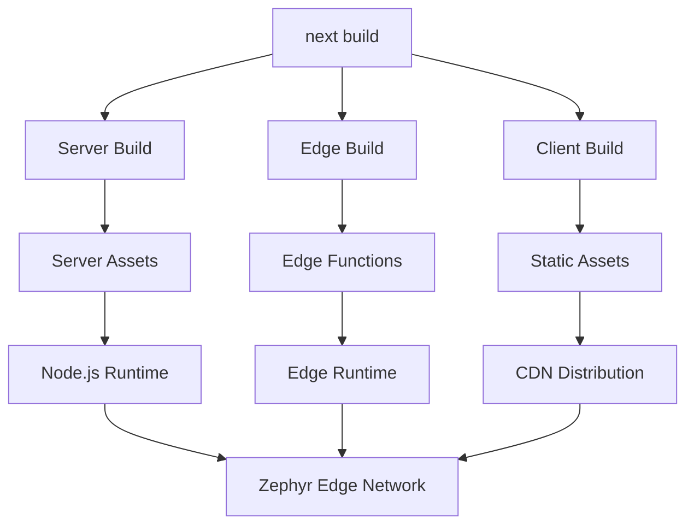

# Zephyr Next.js Plugin

<div align="center">

[Zephyr Cloud](https://zephyr-cloud.io) | [Zephyr Docs](https://docs.zephyr-cloud.io/recipes/nextjs) | [Discord](https://zephyr-cloud.io/discord) | [Twitter](https://x.com/ZephyrCloudIO) | [LinkedIn](https://www.linkedin.com/company/zephyr-cloud/)

<hr/>

</div>

A specialized Next.js plugin for deploying applications with Zephyr Cloud. This plugin seamlessly integrates with Next.js's unique three-phase build system (client, server, and edge) to enable complete deployment of your applications with Module Federation support.

## 🎯 Why This Plugin?

Next.js has a complex build system that creates three separate webpack configurations:
- **Client Build**: Browser-side JavaScript bundles
- **Server Build**: SSR functions for Node.js runtime
- **Edge Server Build**: Code for Edge Runtime environment

The standard `zephyr-webpack-plugin` wasn't compatible with Next.js due to async/sync mismatches and webpack hook timing issues. This plugin solves those problems with a Next.js-specific approach.

## ✨ Features

- 🚀 **Full Next.js Integration**: Works with App Router and Pages Router
- 🏗️ **Three-Phase Deployment**: Deploys client, server, and edge builds
- 📦 **Smart Asset Optimization**: Handles Next.js-specific asset patterns
- 🔧 **Zero-Config Setup**: Works out of the box with sane defaults
- 📊 **Build Analytics**: Complete visibility into deployment process
- 🌐 **Global CDN**: Assets distributed via Zephyr's edge network
- ⚡ **Module Federation**: Full support for micro-frontends
- 🎯 **TypeScript Support**: First-class TypeScript integration

## 📦 Installation

```bash
# npm
npm install --save-dev zephyr-nextjs-plugin

# yarn
yarn add --dev zephyr-nextjs-plugin

# pnpm
pnpm add --save-dev zephyr-nextjs-plugin

# bun
bun add --dev zephyr-nextjs-plugin
```

## 🚀 Quick Start

### Basic Setup

```javascript
// next.config.js
const { withZephyr } = require('zephyr-nextjs-plugin');

/** @type {import('next').NextConfig} */
const nextConfig = {
  webpack: (config, context) => {
    return withZephyr()(config, context);
  },
};

module.exports = nextConfig;
```

### Build and Deploy

```bash
npm run build
```

**Expected Output:**
```bash
✅ Zephyr engine initialized for Next.js
🔧 Zephyr deployment hooks configured for Next.js

# Server Build
ZEPHYR   Uploaded local snapshot in 183ms
ZEPHYR   (8/8 assets uploaded, 956.91kb)
ZEPHYR   https://your-app-server.zephyrcloud.app

# Edge Build  
ZEPHYR   No assets to upload, skipping...
ZEPHYR   https://your-app-edge.zephyrcloud.app

# Client Build
ZEPHYR   Uploaded local snapshot in 107ms
ZEPHYR   (17/21 assets uploaded, 1640.99kb)
ZEPHYR   https://your-app-client.zephyrcloud.app
```

## ⚙️ Configuration

### Available Options

```typescript
interface ZephyrNextJSPluginOptions {
  deployOnClientOnly?: boolean;     // Deploy only client build
  wait_for_index_html?: boolean;    // Wait for index.html processing
  preserveServerAssets?: boolean;   // Preserve server assets
}
```

### Advanced Configuration

```javascript
// next.config.js
const { withZephyr } = require('zephyr-nextjs-plugin');

const nextConfig = {
  webpack: (config, context) => {
    return withZephyr({
      deployOnClientOnly: false,    // Deploy all build types
      wait_for_index_html: true,    // Handle SPA mode
      preserveServerAssets: true,   // Keep server assets
    })(config, context);
  },
  output: 'standalone', // For containerized deployments
};

module.exports = nextConfig;
```

### TypeScript Setup

```typescript
// next.config.ts
import { withZephyr } from 'zephyr-nextjs-plugin';
import type { NextConfig } from 'next';

const nextConfig: NextConfig = {
  webpack: (config, context) => {
    return withZephyr({
      deployOnClientOnly: false,
    })(config, context);
  },
};

export default nextConfig;
```

## 🔧 Module Federation

### Host Application

```javascript
// next.config.js
const { withZephyr } = require('zephyr-nextjs-plugin');
const { NextFederationPlugin } = require('@module-federation/nextjs-mf');

const nextConfig = {
  webpack: (config, context) => {
    // Add Module Federation
    config.plugins.push(
      new NextFederationPlugin({
        name: 'host-app',
        remotes: {
          'remote-app': 'remoteApp@http://localhost:3001/remoteEntry.js',
        },
        shared: {
          react: { singleton: true },
          'react-dom': { singleton: true },
        },
      })
    );

    // Add Zephyr deployment
    return withZephyr()(config, context);
  },
};

module.exports = nextConfig;
```

### Remote Application

```javascript
// next.config.js (remote app)
const { withZephyr } = require('zephyr-nextjs-plugin');
const { NextFederationPlugin } = require('@module-federation/nextjs-mf');

const nextConfig = {
  webpack: (config, context) => {
    config.plugins.push(
      new NextFederationPlugin({
        name: 'remote-app',
        filename: 'remoteEntry.js',
        exposes: {
          './Header': './components/Header',
          './Footer': './components/Footer',
        },
        shared: {
          react: { singleton: true },
          'react-dom': { singleton: true },
        },
      })
    );

    return withZephyr()(config, context);
  },
};

module.exports = nextConfig;
```

## 🏗️ Build Architecture

### Three-Phase Deployment

| Build Phase | Purpose | Assets | Deployment |
|-------------|---------|--------|------------|
| **Server** | SSR for Node.js | Server functions, API routes | Node.js runtime |
| **Edge** | SSR for Edge Runtime | Lightweight functions | Edge workers |
| **Client** | Browser bundles | JS, CSS, static files | CDN distribution |

### Deployment Flow



## 🛠️ Development

### Debug Mode

```bash
DEBUG=zephyr* npm run build
```

### Testing

```bash
# Build the plugin
cd libs/zephyr-nextjs-plugin
pnpm build

# Test with example
cd examples/nextjs-15
pnpm build
```

### Local Development

```bash
# Install dependencies
pnpm install

# Build plugin
pnpm build --filter=zephyr-nextjs-plugin

# Test with Next.js example
cd examples/nextjs-15
pnpm dev
```

## 📊 Performance

### Build Times
- **Development**: ~2-5 seconds (cached)
- **Production**: ~10-30 seconds (full deployment)

### Asset Optimization
- **Differential uploads**: Only changed files uploaded
- **Compression**: Automatic gzip/brotli compression
- **Caching**: Aggressive edge caching strategies

## 🔍 Troubleshooting

### Common Issues

#### 1. Build Fails with Entry Error
```bash
Cannot read properties of undefined (reading 'import')
```
**Solution**: Ensure you're using the correct plugin (`zephyr-nextjs-plugin` not `zephyr-webpack-plugin`)

#### 2. No Deployment URLs Shown
```bash
✅ Zephyr engine initialized for Next.js
# But no deployment URLs...
```
**Solution**: Check authentication with `zephyr login` or set `ZE_SECRET_TOKEN`

#### 3. Module Federation Issues
```bash
Module not found: Can't resolve 'webpack/sharing/consume'
```
**Solution**: Ensure Module Federation plugin is added before Zephyr plugin

### Debug Information

```bash
# Enable all debug logs
DEBUG=zephyr* npm run build

# Check authentication
zephyr whoami

# Verify plugin installation
npm list zephyr-nextjs-plugin
```

## 📋 Requirements

- **Next.js**: 13+ (App Router and Pages Router)
- **Node.js**: 18+
- **Webpack**: 5+ (via Next.js)
- **Zephyr Account**: Sign up at [zephyr-cloud.io](https://zephyr-cloud.io)

## 🤝 Contributing

We welcome contributions! See [DEVELOPMENT.md](./DEVELOPMENT.md) for detailed development documentation.

### Quick Start for Contributors

```bash
# Clone and setup
git clone https://github.com/ZephyrCloudIO/zephyr-packages
cd zephyr-packages
pnpm install

# Build plugin
pnpm build --filter=zephyr-nextjs-plugin

# Test changes
cd examples/nextjs-15
pnpm build
```

## 📚 Examples

Check out complete examples in the [`examples/`](../../examples/) directory:

- [`nextjs-15/`](../../examples/nextjs-15/) - Basic Next.js 15 setup
- More examples coming soon!

## 🆘 Support

- 📖 **Documentation**: [docs.zephyr-cloud.io](https://docs.zephyr-cloud.io)
- 💬 **Discord**: [zephyr-cloud.io/discord](https://zephyr-cloud.io/discord)
- 🐛 **Issues**: [GitHub Issues](https://github.com/ZephyrCloudIO/zephyr-packages/issues)
- 🐦 **Twitter**: [@ZephyrCloudIO](https://x.com/ZephyrCloudIO)

## 📄 License

Licensed under the Apache-2.0 License. See [LICENSE](LICENSE) for more information.