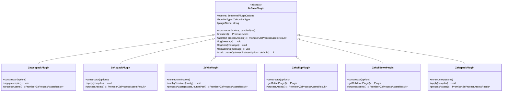
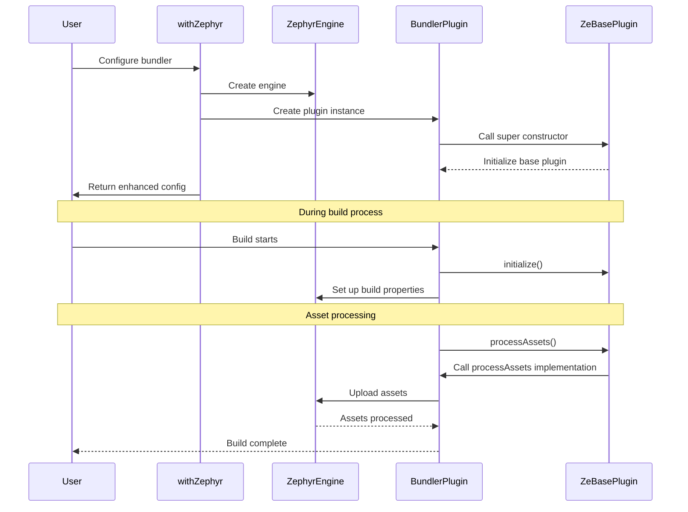
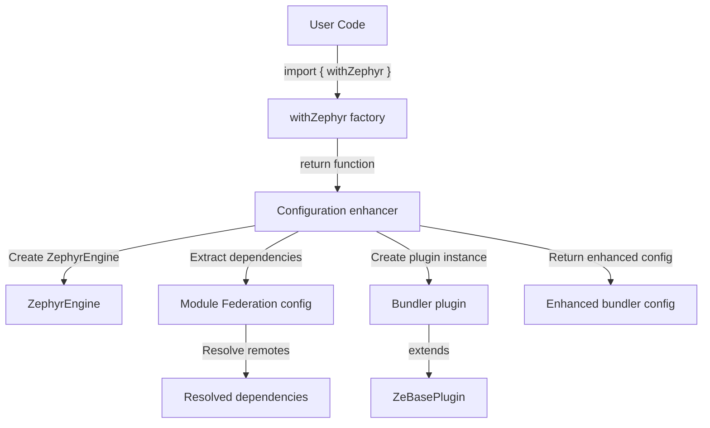
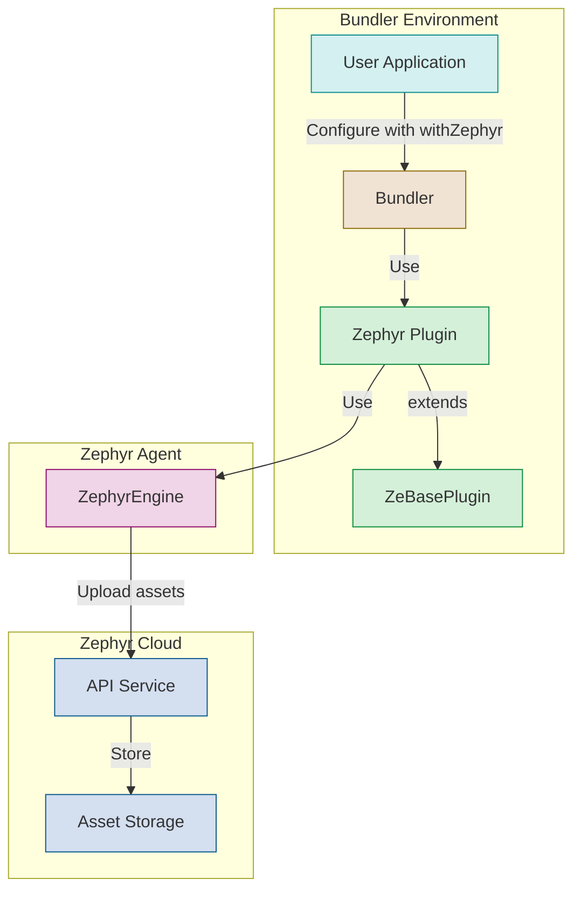
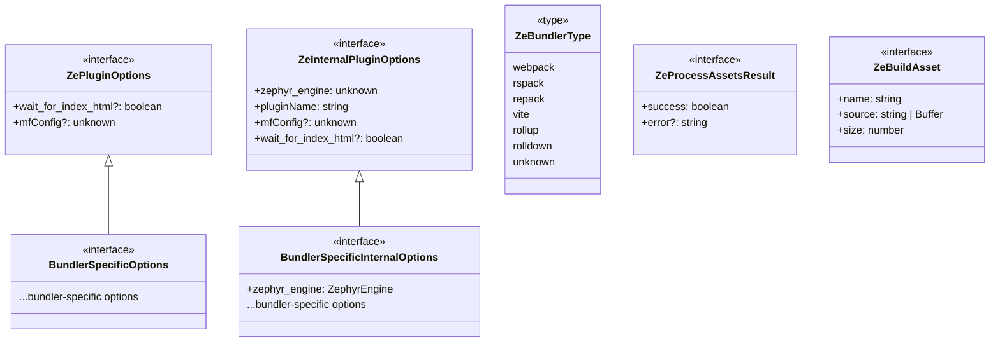

# Zephyr Internal Plugin Architecture

This package contains the shared architecture for all Zephyr bundler plugins. It provides a common foundation to ensure consistent behavior and code reuse across different bundler integrations.

Read more from our documentation [here](https://docs.zephyr-cloud.io).

## Architecture Overview

The architecture is based on a core abstract class `ZeBasePlugin` that defines the common plugin behavior. Specific bundler plugins extend this class to implement bundler-specific logic.



## Plugin Lifecycle

The following diagram illustrates the typical lifecycle of a Zephyr plugin:



## Architecture Components

### ZeBasePlugin

The abstract base class that defines the common interface and behavior for all Zephyr plugins. It provides:

- Common initialization logic
- Logging utilities
- Abstract `processAssets` method that must be implemented by subclasses
- Type safety through generic parameters

### Bundler-Specific Plugins

Each bundler has its own plugin implementation that extends `ZeBasePlugin`:

- `ZeWebpackPlugin`: For webpack integration
- `ZeRspackPlugin`: For Rspack integration
- `ZeVitePlugin`: For Vite integration
- `ZeRollupPlugin`: For Rollup integration
- `ZeRolldownPlugin`: For Rolldown integration
- `ZeRepackPlugin`: For React Native Repack integration

### withZephyr Factory Functions

Each plugin provides a `withZephyr` factory function that:

1. Creates a ZephyrEngine instance
2. Handles Module Federation dependencies (if applicable)
3. Creates the appropriate plugin instance
4. Enhances the bundler configuration



## Plugin Integration Diagram

This diagram shows how the plugins integrate with the bundler and the Zephyr Cloud:



## Type System

The plugin architecture uses a robust type system to ensure type safety and consistency:



## Usage Example

Here's how a user would typically integrate a Zephyr plugin with their bundler configuration:

```typescript
// For webpack
import { withZephyr } from 'zephyr-webpack-plugin';

const webpackConfig = {
  // webpack configuration
};

// Enhance the configuration with Zephyr
export default withZephyr({
  wait_for_index_html: true,
  // Other Zephyr options
})(webpackConfig);

// For Vite
import { withZephyr } from 'vite-plugin-zephyr';

export default {
  plugins: [
    withZephyr({
      wait_for_index_html: true,
      // Other Zephyr options
    }),
    // Other Vite plugins
  ],
  // Other Vite configuration
};
```

## Benefits of the Architecture

- **Code Reuse**: The common logic is defined once in the base class
- **Consistency**: All plugins behave the same way with the same lifecycle
- **Type Safety**: Strong typing ensures correct usage
- **Maintainability**: Changes to the common logic only need to be made in one place
- **Extensibility**: New bundler integrations can be added easily by extending the base class
