# Zephyr Plugins Architecture Diagram

```mermaid
graph TD
    subgraph "Plugin Initialization Flow"
        A[User Config] --> B{Plugin Type}

        B -->|Webpack/Rspack| C1[withZephyr]
        B -->|Rollup/Rolldown| C2[withZephyr]

        C1 -->|async/await| D1[Create ZephyrEngine]
        C2 -->|Promise defer| D2[Create Promise<ZephyrEngine>]

        D1 --> E1[Create Plugin with actual Engine]
        D2 --> E2[Create Plugin with Promise]

        E1 --> F1[Add Plugin to Config]
        E2 --> F2[Return Plugin Object]

        F1 -->|Return| G1[Enhanced Config]
        F2 -->|Return| G2[Plugin Reference]
    end

    subgraph "Build Process Flow"
        H[Build Start] --> I{Plugin Type}

        I -->|Webpack/Rspack| J1[Compiler Hooks]
        I -->|Rollup/Rolldown| J2[buildStart Hook]

        J1 --> K1[setupZeDeploy]
        J2 --> K2[onBuildStart]

        K1 --> L1[processAssets via xpack_zephyr_agent]
        K2 --> L2[writeBundle Hook]

        L1 --> M1[Upload to Zephyr]
        L2 --> M2[onWriteBundle]

        M2 --> N[processAssets]
        N -->|await enginePromise| O[Upload to Zephyr]
    end

    subgraph "Engine Type Differences"
        P[ZephyrEngine Creation]
        P -->|Webpack/Rspack| Q1["await ZephyrEngine.create()"]
        P -->|Rollup/Rolldown| Q2["ZephyrEngine.defer_create()"]

        Q1 --> R1["Direct Engine Access
        zephyr_engine.method()"]
        Q2 --> R2["Promise Resolution
        const engine = await enginePromise
        engine.method()"]
    end
```

## Architecture Explanation

### Plugin Initialization Flow

1. **User Configuration**: Each bundler (Webpack, Rspack, Rollup, Rolldown) has a different configuration approach.

2. **Plugin Type**: Different plugins are created based on the bundler:

   - Webpack/Rspack plugins use an async configuration approach
   - Rollup/Rolldown plugins use a deferred promise approach

3. **Engine Creation**:

   - Webpack/Rspack: `await ZephyrEngine.create()` - waits for engine to be fully initialized
   - Rollup/Rolldown: `ZephyrEngine.defer_create()` - returns a promise that will eventually resolve

4. **Plugin Creation**:
   - Webpack/Rspack: Plugin is created with the actual engine instance
   - Rollup/Rolldown: Plugin is created with a promise to the engine

### Build Process Flow

1. **Build Start**: The bundler begins the build process.

2. **Hook Registration**:

   - Webpack/Rspack: Uses compiler hooks system
   - Rollup/Rolldown: Uses plugin hooks (buildStart, writeBundle)

3. **Asset Processing**:

   - Webpack/Rspack: Calls `setupZeDeploy` which sets up hooks to process assets at the right compilation phase
   - Rollup/Rolldown: Handles assets in the `writeBundle` hook which calls `onWriteBundle` and then `processAssets`

4. **Zephyr Upload**:
   - Webpack/Rspack: Uses `xpack_zephyr_agent` to handle asset upload
   - Rollup/Rolldown: Waits for engine promise to resolve before uploading

### Engine Type Differences

1. **Engine Creation**:

   - Webpack/Rspack: Uses `await ZephyrEngine.create()` to get a fully initialized engine
   - Rollup/Rolldown: Uses `ZephyrEngine.defer_create()` to get a promise to an engine

2. **Engine Access**:
   - Webpack/Rspack: Directly accesses engine methods
   - Rollup/Rolldown: Must resolve the promise and await the engine before using methods

## Key Insight from the Fix

The key issue we fixed was in the Rollup and Rolldown plugins, where they were incorrectly using a `Promise<ZephyrEngine>` as if it were already a resolved `ZephyrEngine`. This led to missing methods like `upload_assets` when the plugins tried to access them.

The solution involved:

1. Properly typing the engine parameter to accept either `ZephyrEngine | Promise<ZephyrEngine>`
2. Using `Promise.resolve()` to ensure we always have a Promise to the engine
3. Adding `await` when accessing engine methods in the `processAssets()` method
4. Adding robust error handling and logging for better debugging

This architectural difference between the plugins explains why Webpack and Rspack plugins continued to work while Rollup and Rolldown plugins broke during refactoring.
